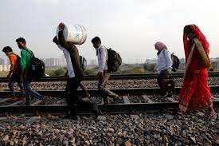
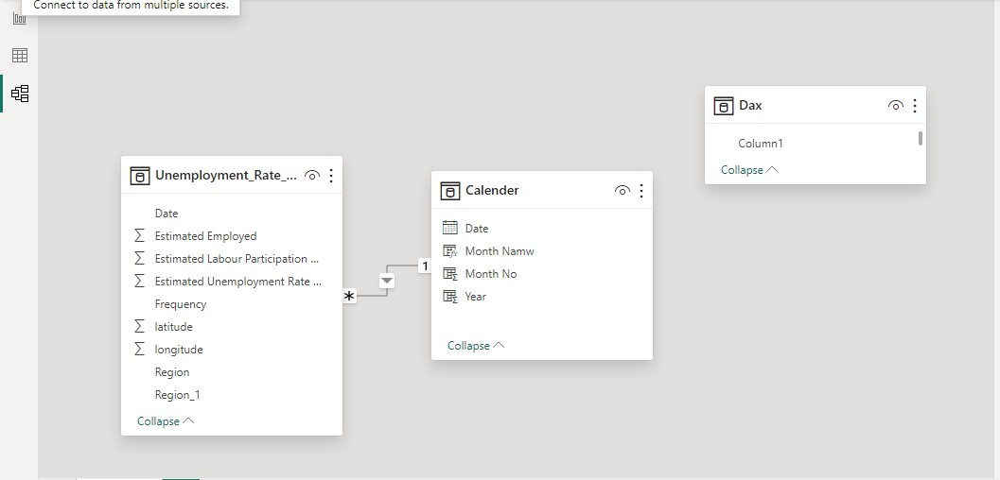
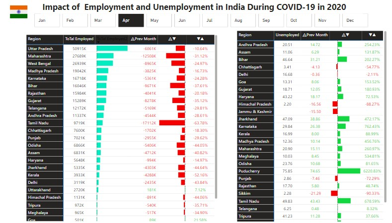

# **Employment and Unemployment in India During COVID-19 (2020)**

## **Introduction**
The COVID-19 pandemic had a profound impact on economies worldwide. In India, it significantly disrupted employment, resulting in variations in employment and unemployment rates across different states. This report analyzes these trends, focusing on changes in employment levels, unemployment rates, and labor participation across Indian states during 2020. The goal is to provide insights into which states were most affected and suggest actions to mitigate future economic shocks.

## **Statement of Problem**
The pandemic led to significant job losses and economic uncertainty across India. Many workers faced layoffs, while some industries struggled to stay afloat. The impact was not uniform, with certain states and sectors more severely affected than others. This study aims to identify:
- The extent of employment and unemployment fluctuations in each state.
- Monthly trends in employment and unemployment during 2020.
- The relationship between labor participation and unemployment during the pandemic.

Star Schema was used 

## **Tools Used**
- **Power BI:** For data visualization and analysis.
- **Excel:** For initial data cleaning and preparation.

## **Link to Report**
You can view the detailed Power BI report [here](https://app.powerbi.com/view?r=eyJrIjoiMzYzMTQwNzktZjRiYi00MjQ3LWI1OWEtZWVmYmI3MGNhZWVmIiwidCI6ImRmODY3OWNkLWE4MGUtNDVkOC05OWFjLWM4M2VkN2ZmOTVhMCJ9).

## **Dataset**
- **Region:** Indian states.
- **Date:** Observed date of unemployment rate.
- **Estimated Unemployment Rate (%):** Percentage of people unemployed in each state.
- **Estimated Employed:** Estimated number of people employed.
- **Estimated Labour Participation Rate (%):** Participation rate calculated by dividing the number of active labor force participants by the total eligible population.
  

## **Insights**
1. **Unemployment Surge in Key States:** States like Maharashtra, West Bengal, and Uttar Pradesh saw significant drops in employment levels during peak pandemic months (e.g., April - June 2020).
   
2. **Labor Force Participation Decline:** The labor participation rate fell significantly in several regions, reflecting both job losses and a reduced number of individuals actively seeking employment.

3. **Recovery in Some States:** As seen from the visualizations, some states (e.g., Andhra Pradesh, Assam) showed signs of recovery in the latter months, with declining unemployment rates.

4. **Severe Impact in Industrial States:** Major industrial hubs like Maharashtra saw the highest employment drops, which can be attributed to the lockdown's effect on manufacturing and services industries.

## **Recommendations**
- **Government Policy Interventions:** Specific states that experienced the most drastic unemployment spikes should be targeted for recovery policies. Tax reliefs, direct support to industries, and employment initiatives would help these regions bounce back faster.
  
- **Training and Reskilling:** The workforce should be provided with opportunities to acquire new skills, particularly in sectors that have shown resilience (e.g., technology). This will ensure that the labor force remains competitive post-pandemic.

- **Focus on Labor Force Participation:** Increasing the labor participation rate should be a priority. Public campaigns and incentives to encourage people to re-enter the labor force will help improve employment numbers.

- **Targeted Economic Stimulus:** States with the largest drops in employment should receive targeted economic stimulus packages to support businesses and create new jobs.

## **Conclusion**
This report highlights the significant impact of COVID-19 on employment and labor participation in India during 2020. While certain regions have shown signs of recovery, the economic shock continues to reverberate across the country. Moving forward, targeted interventions and policy adjustments will be crucial in ensuring a full recovery.

